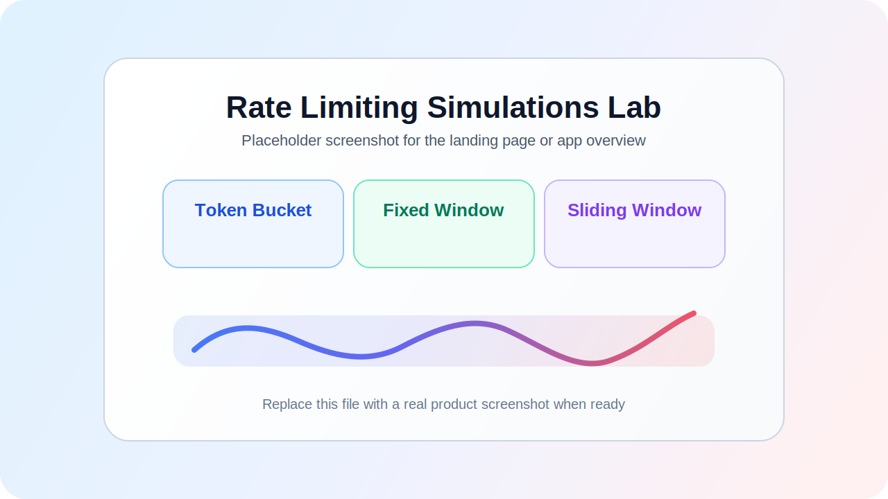
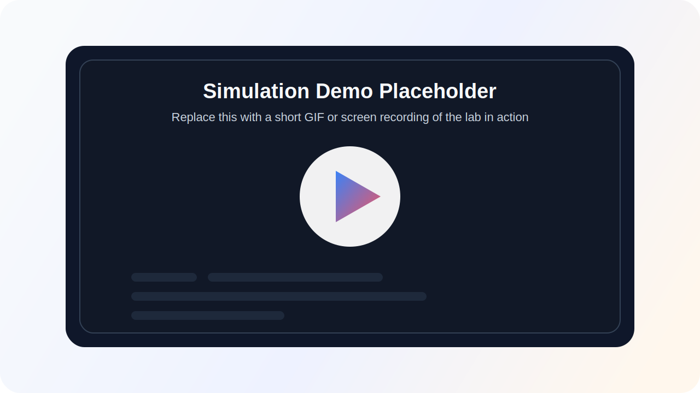
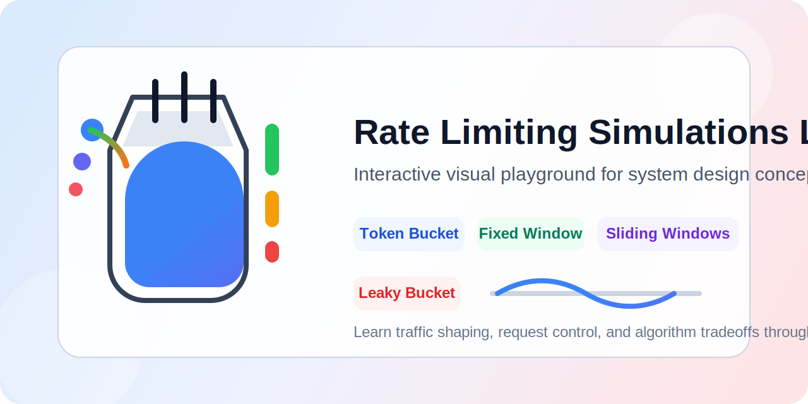

# Rate Limiting Simulations Lab

An interactive simulation lab for exploring how popular rate limiting algorithms behave under load.

This project is built to help developers, students, and interview candidates understand rate limiting visually instead of only reading theory. Each page lets you tweak request settings, run a live simulation, and watch how requests are allowed, rejected, queued, or drained over time.

## What This Project Is About

Rate limiting is one of the most important ideas in backend systems, API protection, and traffic shaping. This lab turns those ideas into hands-on simulations so you can:

- compare different algorithms side by side
- understand how each strategy reacts to bursts and steady traffic
- visualize allowed and rejected requests in real time
- experiment with configuration values like capacity, leak rate, refill rate, request rate, and window size

This is not just a demo app. It is a learning and sharing tool for understanding system design concepts through interaction.

## Live Demo

Try the lab here:

- Live demo: `https://your-live-demo-url.com`

Once you deploy to Vercel, Netlify, or GitHub Pages, replace the placeholder above with your production link.

## Screenshots And GIFs

Add visuals here so visitors can immediately see the app in action.

### App Preview



### Interactive Demo GIF



Suggested captures:

- landing page overview
- token bucket running under burst traffic
- leaky bucket queue filling and draining
- throughput graph reacting to allowed and rejected requests

### Social Preview

Use this image for GitHub repository social preview or link sharing banners:



## Included Simulations

- Token Bucket
- Fixed Window
- Sliding Window Log
- Sliding Window Counter
- Leaky Bucket

Each simulation includes:

- configurable inputs
- live controls
- visual state feedback
- throughput history graphs

## Tech Stack

- React
- TypeScript
- Vite
- SCSS
- React Router
- ECharts

## Local Development

Clone the repository and install dependencies:

```bash
git clone https://github.com/<your-username>/rate-limiting-simulations.git
cd rate-limiting-simulations
npm install
```

Start the development server:

```bash
npm run dev
```

Build for production:

```bash
npm run build
```

Preview the production build locally:

```bash
npm run preview
```

## Deployment

This app is a static frontend, so it can be deployed easily on platforms like:

- Vercel
- Netlify
- GitHub Pages

### Vercel

1. Import the repository into Vercel.
2. Framework preset: `Vite`
3. Build command: `npm run build`
4. Output directory: `dist`

### Netlify

1. Connect the repository to Netlify.
2. Build command: `npm run build`
3. Publish directory: `dist`

### GitHub Pages

You can also deploy the built `dist` output using GitHub Actions or a GitHub Pages deployment workflow.

## Fork And Share

If you find this project useful:

- fork it and build your own simulation ideas on top
- share it with friends, students, or teammates learning system design
- use it in portfolio projects, demos, study groups, or presentations
- open issues or submit improvements

Interesting extension ideas:

- add Redis-backed algorithm demos
- compare algorithms on one dashboard
- add request burst presets
- show latency and queue delay metrics
- support dark mode and accessibility themes

## Why This Lab Matters

A lot of rate limiting explanations stay abstract. This project makes them concrete.

Instead of only hearing that:

- token bucket is good for burst tolerance
- leaky bucket smooths traffic
- fixed windows can create spikes at boundaries
- sliding windows are more accurate

You can actually see those tradeoffs happen.

## Contact

Built by Olayiwola Akinnagbe.

- GitHub: https://github.com/Olayiwola72
- LinkedIn: https://www.linkedin.com/in/olayiwola-akinnagbe/
- Twitter: https://twitter.com/OlayiwolaAkinn1
- Portfolio: https://olayiwola-akinnagbe.netlify.app/
- Resume: https://drive.google.com/file/d/119Hkfzy2sHD9gm9V5Oe4m0Xm5vamPNgt/view?usp=sharing
- Email: olayiwola72@gmail.com

If you would like to collaborate, give feedback, or hire me, feel free to reach out.
